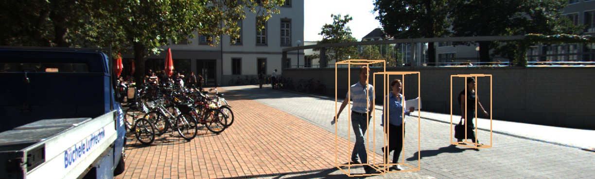
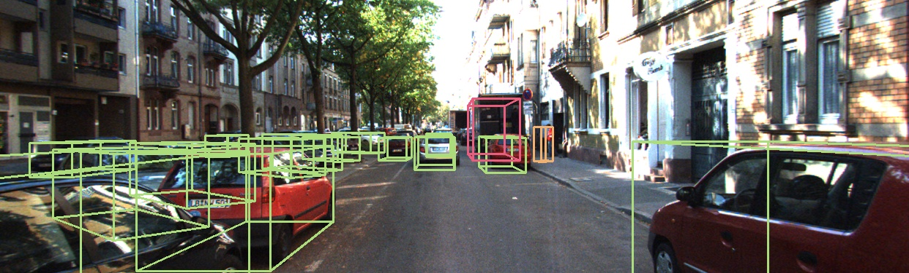

# 📝 sensor visualization toolbox  #
***

This toolbox is meant to support general sensor dataset, so the design of the functions is kept as generic as possible.

Currently, data from Kitti dataset will be used to test the functionality of this toolbox.

## :tada: TODO ##
***

- [x] lidar(point cloud) and camera
- [x] 3d bounding box on image
- [ ] 3d bounding box on point cloud and bev

## 🎛  Dependencies ##
***

```bash
conda env create --file environment.yml
conda activate sensor_visualization_toolbox
```

## :running: How to Run ##
***

- project point cloud to image and colorize point cloud: the pairs of pcds and images are downloaded from [HERE](http://www.cvlibs.net/datasets/kitti/eval_object.php?obj_benchmark=3d)
```bash
python scripts/visualize_lidar_camera.py --json_info_path ./data/samples/data_info.json --image_path ./data/samples/000000.png --cloud_path ./data/samples/000000.pcd
```

<table width="100%">
    <tr>
        <td width="50%" align="center">project point cloud to image</td>
        <td width="50%" align="center">colorize point cloud</td>
    </tr>
    <tr>
        <td width="50%" align="center"></td>
        <td width="50%" align="center">
    </tr>
</table>

- draw 3d object on image
```bash
python scripts/draw_object3d_on_image.py -l ./data/samples/000122.txt -j ./data/samples/data_info.json -i ./data/samples/000122.png
```

<table width="100%">
    <tr>
        <td width="50%" align="center"></td>
        <td width="50%" align="center">
    </tr>
</table>

## :gem: References ##
***

- [Vision meets Robotics: The KITTI Dataset](http://www.cvlibs.net/publications/Geiger2013IJRR.pdf): you can find explanation about calib parameters of the Kitti dataset here.
